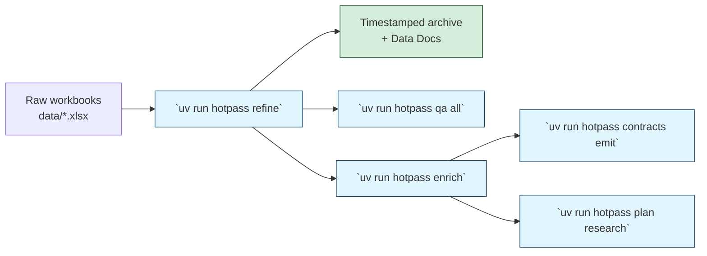

# Hotpass

You use Hotpass to turn messy spreadsheet collections into governed, analysis-ready workbooks. The CLI and MCP tooling share the same verbs, so you can refine, enrich, run QA, and orchestrate flows from the terminal, an agent, or CI without rewriting steps.

## Quick Overview



_For detailed architecture diagrams, see [System Architecture](docs/diagrams/system-architecture.mmd), [Data Flow](docs/diagrams/data-flow.mmd), and [Run Lifecycle](docs/diagrams/run-lifecycle.mmd)._

## Why teams choose Hotpass

- **Profile driven**: You load sector-specific profiles (aviation, generic, custom) that align validation rules, mappings, and provenance expectations with your domain.
- **Quality first**: Great Expectations suites, Frictionless contracts, and POPIA-aware compliance checks surface failing sheets with remediation tips before you hand off outputs.
- **Operable from day one**: Prefect orchestration, OpenTelemetry exporters, and a Streamlit dashboard ship ready to run; tunnels, context bootstrap, and ARC checks are first-class CLI verbs.
- **Research ready**: Deterministic enrichment works offline. When you enable network research, throttled crawlers and provenance tracking keep audits defensible.

## Local-first operating model

- **Run everything locally first.** `deploy/docker/docker-compose.yml` already ships Prefect, Marquez, Hotpass Web, MinIO, LocalStack, SearXNG, the OTLP collector, and an optional Ollama sidecar. Use it to unblock Prefect/Marquez reachability before reaching for VPNs or bastions.
- **Self-host the core services.** Export the endpoints listed below (or generate them via `hotpass env`) so swapping environments is just a profile change.
- **Swap AWS for LocalStack/MinIO in dev.** Prefect blocks and pipeline storage point at MinIO by default; LocalStack provides the remaining AWS APIs while you stay offline.
- **ARC runners and LLMs stay local.** ARC runs on kind/minikube, and the Compose `llm` profile routes LLM traffic to Ollama until you intentionally opt into Groq/OpenRouter.
- **Networked enrichment stays opt-in.** Offline is the default (`--allow-network` omitted). Point enrichment at the bundled SearXNG instance when you need deterministic search, and only enable remote calls once compliance guardrails are in place.

Bring up the stack:

```bash
cd deploy/docker
# Prefect, Marquez, MinIO, LocalStack, SearXNG, OTLP, Hotpass web
docker compose up -d --build
# Optional Ollama sidecar
docker compose --profile llm up -d
```

Services and default endpoints:

| Service                | Ports     | Environment variable                                |
| ---------------------- | --------- | --------------------------------------------------- |
| Prefect server         | 4200      | `PREFECT_API_URL=http://127.0.0.1:4200/api`         |
| Marquez                | 5002      | `OPENLINEAGE_URL=http://127.0.0.1:5002/api/v1`      |
| OTLP collector         | 4317/4318 | `OTEL_EXPORTER_OTLP_ENDPOINT=http://127.0.0.1:4318` |
| MinIO (S3)             | 9000      | `HOTPASS_S3_ENDPOINT=http://127.0.0.1:9000`         |
| LocalStack             | 4566      | `LOCALSTACK_ENDPOINT=http://127.0.0.1:4566`         |
| SearXNG                | 8080      | `HOTPASS_SEARX_URL=http://127.0.0.1:8080`           |
| Ollama (profile `llm`) | 11434     | `HOTPASS_LLM_BASE_URL=http://127.0.0.1:11434`       |

Generate a `.env` file that points at the local stack (add `--include-credentials` to reuse values from `hotpass credentials wizard`):

```bash
uv run hotpass env --target local \
  --prefect-url http://127.0.0.1:4200/api \
  --openlineage-url http://127.0.0.1:5002/api/v1 \
  --force
```

The command now records `HOTPASS_S3_ENDPOINT` and `LOCALSTACK_ENDPOINT`, so Prefect workers, ARC diagnostics, and CLI commands inherit the MinIO/LocalStack defaults without extra flags.

Import the matching Prefect profile so CLI, Prefect UI, and workers share the same defaults:

```bash
prefect profile import prefect/profiles/local.toml
prefect profile use hotpass-local
```

Toggle `--allow-network` only when you intentionally want online enrichment. Reuse the same commands with staging/production URLs and profile overlays so the workflow stays identical.

## 10-minute quickstart

1. **Create an environment**

   ```bash
   uv venv
   uv sync --extra dev --extra docs
   ```

````

Add orchestration or enrichment extras up front (`uv sync --extra dev --extra docs --extra orchestration --extra enrichment`) so the firewall lock-down never blocks later installs.

1. **Discover the CLI surface**

 ```bash
 uv run hotpass overview
````

```
 ╭─────────────────────────────── About Hotpass ────────────────────────────────╮
 │ Hotpass Data Refinement Platform                                             │
 │ Version: 0.2.0                                                               │
 ╰──────────────────────────────────────────────────────────────────────────────╯
 ┏━━━━━━━━━━━━━━━━━┳━━━━━━━━━━━━━━━━━━━━━━━━━━━━━━━━━━━━━━━━━━━━━━━━━━━━━━━━━━━━┓
 │ Command         │ Description                                                │
 ┡━━━━━━━━━━━━━━━━━╇━━━━━━━━━━━━━━━━━━━━━━━━━━━━━━━━━━━━━━━━━━━━━━━━━━━━━━━━━━━━┩
 │ refine          │ Run the Hotpass refinement pipeline on input data          │
 │ enrich          │ Enrich refined data with additional information            │
 │ qa              │ Run quality assurance checks and validation                │
 │ contracts       │ Emit data contracts and schemas for a profile              │
 │ setup           │ Run the guided staging wizard (deps, tunnels, contexts,    │
 │                 │ env)                                                       │
 │ …               │ …                                                          │
 └─────────────────┴────────────────────────────────────────────────────────────┘
```

1. **Bootstrap a workspace**

   ```bash
   uv run hotpass init --path ./hotpass-workspace
   cd hotpass-workspace
   ```

   ```
   Hotpass workspace initialised at …/hotpass-workspace
   Generated artefacts:
     - config
     - config/profiles
     - data
     - dist
     - prefect
     - config/pipeline.quickstart.toml
     - config/profiles/quickstart.toml
   ```

1. **Load a sample workbook and validate the environment**

   ```bash
   cp ../data/'Reachout Database.xlsx' data/
   uv run hotpass doctor --config ./config/pipeline.quickstart.toml
   ```

   ```
   Environment diagnostics
   [PASS] environment.python_version: Python 3.13 detected
   [PASS] environment.input_dir: Input directory ready: data
   Configuration diagnostics
   [PASS] governance.data_owner: Data owner registered as 'Data Governance'.
   ```

1. **Run the refinement pipeline with the bundled profile**

   ```bash
   uv run hotpass refine \
     --input-dir ./data/e2e \
      --output-path ./dist/refined.xlsx \
      --profile generic \
      --expectation-suite reachout_organisation \
      --archive
   ```

   The command writes refined outputs to `dist/refined.xlsx` and publishes the
   latest Great Expectations Data Docs under `dist/data-docs/`.
   Use `--input-dir ./data` when you want to exercise the full messy workbook
   set; the curated `data/e2e` sample keeps contract validation green for quick
   verification runs.

   Outputs land under `dist/` (`refined.xlsx`, `refined.parquet`, and a timestamped archive). The warning reminds you to triage the low data-quality score before sharing the workbook.

   > **Heads-up:** The SACAA workbook includes duplicate organisations. Hotpass now keeps the
   > first occurrence automatically, exports the duplicate rows to
   > `dist/contract-notices/<run-id>/sacaa-cleaned-duplicates.csv`, and surfaces the warning in the
   > quality recommendations so you can review them after the run.

1. **Run the platform QA gates**

   ```bash
   uv run hotpass qa all --profile generic \
     --profile-search-path ../apps/data-platform/hotpass/profiles
   ```

   ```bash
   Running: CLI Integrity          ✓ 13/13 checks passed
   Running: Fitness Functions      ✓ All fitness functions satisfied
   Running: Data Quality (GE)      ✓ 7/7 checks passed
   Running: Documentation Checks   ✓ 9/9 checks passed
   ✓ All QA checks passed
   ```

1. **Plan enrichment or research (optional)**

   ```bash
   uv run hotpass plan research \
     --dataset ./dist/refined.xlsx \
     --row-id 0 \
     --allow-network=false
   ```

   Enable network-backed enrichment only after the compliance controls in the profile (intent statements, rate limits, and provenance requirements) are approved.

With the workspace validated you can branch into the tutorials (refine + orchestrate), follow the operator runbook, or wire up MCP tools for assistants.

### Docker compose (local stack)

For an end-to-end sandbox run:

```bash
cd deploy/docker
docker compose up --build
# Optional LLM sidecar:
docker compose --profile llm up
```

The startup banner will remind you to open the VPN/bastion if the Prefect or Marquez health checks remain red.

### Automate tunnels and contexts

The CLI now provides one-command automation for tunnels, AWS identity checks, context bootstrap, and staging-ready environment files:

- Run the guided setup wizard (sync extras, open tunnels, configure contexts, emit `.env` files) in one go:

  ```bash
  hotpass setup --preset staging --host bastion.example.com --dry-run   # review plan
  hotpass setup --preset staging --host bastion.example.com --execute   # run plan
  ```

- Establish local forwards for Prefect and Marquez:

  ```bash
  hotpass net up --host bastion.example.com --detach
  ```

- Inspect or tear down active tunnels:

  ```bash
  hotpass net status
  hotpass net down --label staging
  ```

- Validate AWS credentials and store the summary:

  ```bash
  hotpass aws --profile staging --output text
  ```

- Create a Prefect profile and kubeconfig context (derives ports from active tunnels):

  ```bash
  hotpass ctx init --prefect-profile hotpass-staging --eks-cluster hotpass-staging
  ```

- Review stored context metadata before writing `.env` files:

  ```bash
  hotpass ctx list
  ```

- Generate an `.env` file aligned with the current session:

  ```bash
  hotpass env --target staging --force
  ```

  Include `--include-credentials` to inject stored secrets into the generated file. The command also writes `HOTPASS_S3_ENDPOINT` and `LOCALSTACK_ENDPOINT` automatically so Prefect workers, ARC diagnostics, and CI jobs inherit the same MinIO/LocalStack endpoints without extra flags.

## Inventory configuration

- `HOTPASS_INVENTORY_PATH` — override the path to `data/inventory/asset-register.yaml` when packaging or sourcing manifests externally.
- `HOTPASS_INVENTORY_FEATURE_STATUS_PATH` — override the feature status metadata file consumed by `hotpass inventory status` and `/api/inventory`.
- `HOTPASS_INVENTORY_CACHE_TTL` / `HOTPASS_INVENTORY_CACHE_TTL_MS` — adjust cache TTL (seconds or milliseconds, non-negative integers) shared by the CLI and web API.

### Keep uv caches on an external SSD

When running Hotpass from `/Volumes/APFS Space/GitHub/Hotpass` (or another external
volume), redirect `uv`'s data and cache directories so they live on the same drive:

```bash
chmod +x ops/use-ssd-env.sh
./ops/use-ssd-env.sh uv sync
```

The helper sets `UV_DATA_DIR` and `UV_CACHE_DIR` to the SSD and then executes the
given command, so virtual environments, wheels, and build artefacts no longer grow
under `~/.cache` on the internal disk.

Working on a hosted runner? Use `make sync EXTRAS="dev orchestration enrichment geospatial compliance dashboards"`
to replicate the environment bootstrap above with a single command.

## Preflight checks

Run these gates before opening a pull request so local results align with CI:

- `make qa` — runs Ruff format/lint, pytest with coverage, mypy, Bandit,
  detect-secrets, and pre-commit hooks.
- `uv run hotpass qa all` — executes the CLI-driven quality gates (QG‑1 → QG‑5)
  and mirrors the GitHub Actions workflow.
- `uv run python ops/validation/refresh_data_docs.py` — refreshes Data Docs
  to confirm expectation suites remain in sync with contracts.
- `uv run python ops/quality/fitness_functions.py` — exercises the
  architectural fitness checks documented in `docs/architecture/fitness-functions.md`.
- `uv run pytest -n auto` — executes the full test suite in parallel (mirrors CI’s xdist configuration).
- `cd deploy/docker && docker compose up -d --build` — verify the self-hosted stack locally (the [`self-hosted-smoke`](.github/workflows/self-hosted-smoke.yml) workflow runs the same Compose bundle plus Hotpass Web in CI). Tear it down with `docker compose down -v` when finished.
- Optional: set `HOTPASS_ENABLE_PRESIDIO=1` before running if you need Presidio-backed
  PII redaction. By default Hotpass skips the heavy Presidio models to keep offline
  runs self-contained.

## Developer tips: Trunk (format/lint)

- Install the Trunk CLI once to get consistent formatting and security checks across local and CI: `bash scripts/testing/install_trunk.sh`.
- Use `make qa-trunk` to run only the linting/format checks (Ruff, ruff-format, isort, mypy, bandit, etc.).
- Use `make qa` for the full local QA suite (adds pytest coverage and pre-commit checks).

On orchestrated environments, register multiple Prefect workers against a shared pool so
`uv run hotpass qa all` and pipeline runs can execute in parallel. Monitor worker heartbeats
in Prefect and align worker images with the same `uv` environment you use locally.

## Post-deploy observability validation

After each deploy, confirm the runtime surfaces are healthy before handing over to operations:

- **Lineage UI** – follow the [lineage smoke test runbook](docs/operations/lineage-smoke-tests.md) to verify Marquez ingests new runs, capture the datasets/jobs graph, and archive API payloads under `dist/staging/marquez/`.
- **Prefect guardrails** – run the [Prefect backfill guardrail rehearsal](docs/operations/prefect-backfill-guardrails.md) to ensure concurrency limits remain intact and Prefect logs are stored in `dist/staging/backfill/`.
- **OpenTelemetry exporters** – review the [observability registry overview](docs/observability/index.md) and confirm OTLP endpoints receive spans/metrics (or console exporters flush) using the compose stack shipped in `deploy/docker/docker-compose.yml`. Document any overrides in `Next_Steps.md` before declaring the release healthy.

## Architecture

Hotpass is built with a modular architecture that separates concerns across CLI, pipeline, orchestration, and governance layers. Three diagrams provide complementary views:

### System Architecture

The [system architecture diagram](docs/diagrams/system-architecture.mmd) shows all major components and their relationships:

- **CLI & Operators**: `hotpass` CLI (28 commands), `hotpass-operator` wizard, and MCP server
- **Core Pipeline**: Refinement, enrichment, entity resolution, and QA engines
- **Orchestration**: Prefect workflows, Marquez lineage, OpenTelemetry observability
- **Storage**: MinIO/S3, LocalStack, timestamped archives
- **Research**: SearXNG meta-search, rate-limited crawlers, optional LLM integration
- **Governance**: Data contracts (Frictionless), Great Expectations docs, Presidio PII redaction, POPIA compliance
- **Infrastructure**: SSH/SSM tunnels, GitHub ARC runners, Prefect/K8s context bootstrap

### Data Flow

The [data flow diagram](docs/diagrams/data-flow.mmd) traces how data transforms from raw input to governed output:

1. **Input Stage**: Raw workbooks + profile configuration
2. **Refinement Pipeline**: Load → normalise → deduplicate → validate → score quality
3. **Primary Output**: Refined XLSX/Parquet + timestamped archives
4. **Enrichment** (optional): Deterministic lookups → network research (when `--allow-network`) → provenance tracking
5. **Entity Resolution** (optional): Splink linkage → cluster formation → Label Studio review
6. **Quality Assurance**: Great Expectations validation → Frictionless contracts → Data Docs generation
7. **Governance Outputs**: Schema exports, audit artefacts, POPIA compliance reports

### Run Lifecycle

The [run lifecycle diagram](docs/diagrams/run-lifecycle.mmd) is a sequence diagram showing a complete `hotpass refine` → `hotpass qa` → `hotpass enrich` cycle with all integrations:

- Profile loading and validation
- OpenTelemetry trace spans
- Marquez lineage recording
- Great Expectations validation
- Archive and storage operations
- Optional QA, enrichment, and research planning steps

All diagrams are maintained as [Mermaid](https://mermaid.js.org/) source files under `docs/diagrams/` and kept in sync with code changes through automated documentation verification (see `scripts/verify_docs.py`).

## Documentation

The full documentation lives under [`docs/`](docs/index.md) and follows the Diátaxis framework:

- [Tutorials](docs/tutorials/quickstart.md) — end-to-end walkthroughs.
- [How-to guides](docs/how-to-guides/configure-pipeline.md) — targeted tasks such as configuring profiles or enabling observability. See the [dependency profile guide](docs/how-to-guides/dependency-profiles.md) to pick the right extras.
- [Reference](docs/reference/cli.md) — command syntax, data model, and expectation catalogue.
- Governance artefacts — [Data Docs](docs/reference/data-docs.md),
  [schema exports](docs/reference/schema-exports.md), and the
  [Marquez lineage quickstart](docs/observability/marquez.md).
- [Explanations](docs/explanations/architecture.md) — architectural decisions and platform scope.
- [Roadmap](docs/roadmap.md) — delivery status, quality gates, and tracked follow-ups. See also the
  repository-level [ROADMAP.md](ROADMAP.md) for a per-phase PR checklist.
- [Research-first orchestration](docs/reference/profiles.md#provider-guardrails) — profile-driven rate limits, audit artefacts, and MCP/CLI workflows for plan/crawl operations.

## Contributing

Read the [documentation contributing guide](docs/CONTRIBUTING.md) and [style guide](docs/style.md), then submit pull requests using Conventional Commits. The contributing guide now includes a five-minute documentation quickstart plus preflight reminders. Run the consolidated QA suite before opening a PR:

```bash
make qa
```

The `qa` target runs Ruff formatting and linting, pytest with coverage, mypy (strict for the pipeline configuration module and QA tooling), Bandit, detect-secrets, and repository pre-commit hooks so local results match CI.

Join the conversation in the `#hotpass` Slack channel or open an issue using the templates under `.github/ISSUE_TEMPLATE/`.
