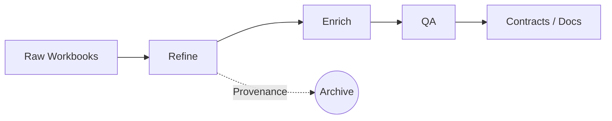

# Hotpass Agent Guide

**Audience:** GitHub Copilot, Codex, and other AI coding assistants
**Last Updated:** 2025-11-01
**Maintainers:** Platform Engineering (platform@hotpass.example)

> This guide follows the [Diátaxis](https://diataxis.fr/) framework. Each section is labelled as a tutorial, how-to, reference, or explanation so agents can quickly find the right level of detail.

---

## At a Glance *(Explanation)*

Hotpass turns semi-structured spreadsheets into a governed, traceable data asset. Agents interact with the system through the CLI (`uv run hotpass …`) or the MCP server (`python -m hotpass.mcp.server`). Workstation and CI runners are locked down: deterministic steps execute offline by default, while network enrichment and crawlers require explicit approval.



**Core principles**

1. **Profile first** – always select a profile (`aviation`, `generic`, or custom) to load the correct rules.
2. **Deterministic first** – prefer offline enrichment before enabling network fetches.
3. **Provenance mandatory** – every new field must record source, timestamp, and confidence.
4. **Safe by default** – network operations and mutating commands run only with explicit opt-in.

---

## Quickstart Tutorial *(Tutorial)*

Follow these steps to refine, enrich, and validate a workbook end-to-end.

1. **Inspect inputs**
   ```bash
   ls data/*.xlsx
   ```
2. **Refine**
   ```bash
   uv run hotpass refine \
     --input-dir ./data \
     --output-path ./dist/refined.xlsx \
     --profile aviation \
     --archive
   ```
3. **Review results**
   - Confirm `dist/refined.xlsx` exists.
   - Inspect QA notes under `dist/quality-gates/`.
4. **Enrich deterministically**
   ```bash
   uv run hotpass enrich \
     --input ./dist/refined.xlsx \
     --output ./dist/enriched.xlsx \
     --profile aviation \
     --allow-network=false
   ```
5. **Optional network enrichment**
   ```bash
   export FEATURE_ENABLE_REMOTE_RESEARCH=1
   export ALLOW_NETWORK_RESEARCH=1
   uv run hotpass enrich \
     --input ./dist/refined.xlsx \
     --output ./dist/enriched-network.xlsx \
     --profile aviation \
     --allow-network=true
   ```
6. **Run targeted QA**
   ```bash
   uv run hotpass qa fitness
   uv run hotpass qa profiles
   ```
7. **Generate contracts**
   ```bash
   uv run hotpass contracts emit \
     --profile aviation \
     --output ./contracts/aviation.yaml \
     --format yaml
   ```

> **MCP equivalent:** start the server with `uv run python -m hotpass.mcp.server` and call tools such as `hotpass.refine`, `hotpass.enrich`, or `hotpass.qa` with matching parameters.

---

## How-To Guides *(How-to)*

### Hotpass CLI Cheatsheet

| Task | Command | Notes |
|------|---------|-------|
| Inspect capabilities | `uv run hotpass overview` | Lists profiles, commands, examples |
| Refine data | `uv run hotpass refine --input-dir … --profile …` | Use `--archive` to snapshot sources |
| Enrich deterministically | `uv run hotpass enrich --allow-network=false` | Safe on air-gapped runners |
| Enrich with network | `FEATURE_ENABLE_REMOTE_RESEARCH=1 ALLOW_NETWORK_RESEARCH=1 uv run hotpass enrich --allow-network=true` | Requires allow-listed domains |
| Run QA suites | `uv run hotpass qa all` or `qa fitness` / `qa docs` / `qa ta` | Mirrors Quality Gate expectations |
| Emit contracts | `uv run hotpass contracts emit --format yaml` | Results land under `./contracts` |

### Launching and Using the MCP Server

```bash
uv run python -m hotpass.mcp.server
```

Available tools: `hotpass.refine`, `hotpass.enrich`, `hotpass.qa`, `hotpass.explain_provenance`, `hotpass.crawl` (network guarded). Discover tools via `{"jsonrpc":"2.0","id":1,"method":"tools/list"}` and call with JSON payloads.

### Choosing the Right Test Tier

| Situation | Run | Command |
|-----------|-----|---------|
| Fast validation on PR | Smoke suite | `scripts/testing/smoke.sh` or `make qa` |
| Full regression / nightly | Full suite | `scripts/testing/full.sh` or `make qa-full` |
| Front-end unit coverage only | Vitest | `cd apps/web-ui && npm run test:unit` |
| E2E UX validation | Playwright | `cd apps/web-ui && npm run test:e2e` |

Smoke executes Ruff lint, the Python smoke marker set, coverage export, and Vitest coverage. Full runs add the entire pytest tree, the coverage guard (`tools/coverage/report_low_coverage.py`), mypy, Bandit, detect-secrets, and pre-commit hooks. See [Engineering → Testing](engineering/testing.md) for thresholds and CI wiring.

### Working Safely on Ephemeral Runners

1. Stick to smoke scripts unless you need deep coverage—full suite can exhaust short-lived runners.
2. Network extras are blocked by default; declare domains via `HOTPASS_UV_EXTRAS` and environment exports before execution.
3. Use the Playwright config defaults (`workers: 2`, `trace: on-first-retry`) when running UX tests from automation.

### Handling Failures

- **Coverage regression:** inspect `htmlcov/index.html` and the per-file summary printed by `report_low_coverage.py`. Add focused unit tests before retrying.
- **QA failures:** rerun the specific QA target (fitness, profiles, docs, ta) with `-vv` for detail.
- **Network errors:** confirm the allow-list in `.github/workflows/quality-gates.yml` or environment overrides before escalating network operations.

---

## Interface Reference *(Reference)*

### CLI Commands

| Command | Description | Key Flags |
|---------|-------------|-----------|
| `hotpass overview` | Lists commands, profiles, and quick links | `--json` for machine output |
| `hotpass refine` | Cleans, normalises, archives input data | `--input-dir`, `--output-path`, `--profile`, `--archive` |
| `hotpass enrich` | Adds deterministic and optional network data | `--allow-network`, `--profile`, `--output` |
| `hotpass qa` | Runs QA suites | `--target (all\|fitness\|profiles\|docs\|ta)` |
| `hotpass contracts emit` | Emits contract artefacts | `--profile`, `--format`, `--output` |
| `hotpass explain-provenance` | Shows provenance for a single row | `--dataset`, `--row-id`, `--json` |
| `hotpass crawl` | Executes crawler flow (guarded) | `--allow-network`, `--profile`, `--backend` |

### MCP Tools

| Tool | Purpose | Signature |
|------|---------|-----------|
| `hotpass.refine` | Refinement pipeline | `input_path`, `output_path`, `profile`, `archive` |
| `hotpass.enrich` | Deterministic / network enrichment | `input_path`, `output_path`, `profile`, `allow_network` |
| `hotpass.qa` | Quality checks | `target` (`all`, `fitness`, `profiles`, `docs`, `ta`) |
| `hotpass.explain_provenance` | Row-level provenance | `dataset_path`, `row_id` |
| `hotpass.crawl` | Research crawl (requires approvals) | `query_or_url`, `profile`, `allow_network` |

### Essential Environment Variables

| Variable | Purpose |
|----------|---------|
| `HOTPASS_UV_EXTRAS` | Extras installed by `ops/uv_sync_extras.sh` (e.g., `"dev orchestration"`) |
| `FEATURE_ENABLE_REMOTE_RESEARCH` | Enables network research features when set to `1` |
| `ALLOW_NETWORK_RESEARCH` | Allows crawler to make network calls when set to `1` |
| `OPENLINEAGE_URL` / `VITE_MARQUEZ_API_URL` | Targets the Marquez API for lineage visualisations |
| `PREFECT_API_URL` / `VITE_PREFECT_API_URL` | Targets Prefect API for run telemetry |

---

## Operating Model *(Explanation)*

### Network Safety

- CLI commands default to offline operations.
- Network enrichment and crawling require both environment flags *and* allow-listed domains in CI (`quality-gates.yml`).
- For MCP, reject requests that combine `allow_network=true` with missing approvals.

### Telemetry & Provenance

- `TelemetryBootstrapOptions` control OpenTelemetry export; by default agents should leave telemetry disabled (`enabled=False`).
- Every enriched dataset must include `provenance_source`, `provenance_timestamp`, `provenance_confidence`, and `provenance_strategy`. Network-based enrichment sets `provenance_network_status` to `online`.

### Testing Lifecycle

1. **PRs** run the smoke workflow (`ci-smoke.yml`) capturing smoke pytest + Vitest coverage.
2. **Nightly** quality gate workflow executes full pytest, gate-specific tests, coverage guard, and a Playwright shard.
3. **Scheduled e2e** (`playwright-nightly.yml`) runs Playwright across Chromium with traces for diagnostics.
4. Coverage guard thresholds currently surface modules below 5 % line coverage—ratchet upwards as components gain tests.

---

## Related Documents *(Reference)*

- [Engineering › Testing strategy](engineering/testing.md)
- [UPGRADE.md](../UPGRADE.md) – release requirements
- [`tools.json`](../tools.json) – MCP tool contract
- [Quality Gate tests](../tests/cli/test_quality_gates.py)

For questions or updates, ping `#hotpass-platform` or open a documentation issue.
