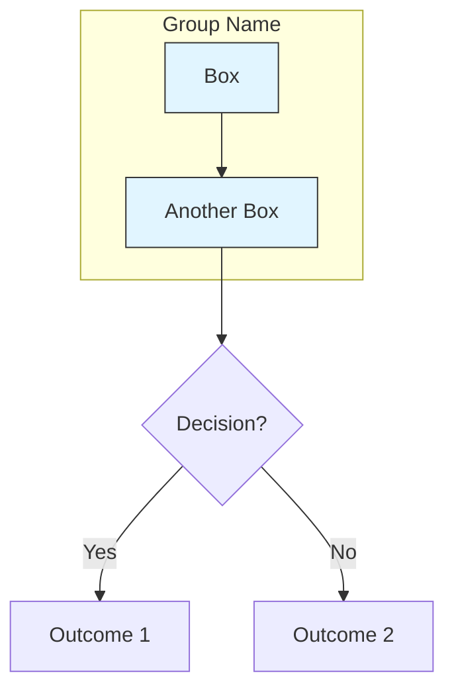

# Hotpass Architecture Diagrams

This directory contains Mermaid diagram source files that document the Hotpass system architecture.

## Diagrams

### [system-architecture.mmd](system-architecture.mmd)

**Purpose:** High-level component view showing all major subsystems and their relationships.

**Contents:**

- CLI & Operators layer (hotpass, hotpass-operator, MCP server)
- Core Pipeline (refinement, enrichment, resolution, QA)
- Orchestration Layer (Prefect, Marquez, OpenTelemetry)
- Storage & State (MinIO/S3, LocalStack, archives)
- Research & Enrichment (SearXNG, crawlers, LLMs)
- Governance & Compliance (contracts, Data Docs, Presidio, POPIA)
- Infrastructure (tunnels, ARC, contexts)

**Use when:** You need to understand how components interact or where to add new functionality.

### [data-flow.mmd](data-flow.mmd)

**Purpose:** End-to-end data transformation pipeline from raw input to governed output.

**Flow:**

1. Input Stage (raw workbooks + profiles)
2. Refinement Pipeline (load → normalise → dedupe → validate → score)
3. Primary Output (refined datasets + archives)
4. Optional Enrichment (deterministic + network research)
5. Optional Resolution (Splink linkage + Label Studio)
6. Quality Assurance (Great Expectations + Frictionless)
7. Governance Outputs (schemas + audit + compliance)

**Use when:** You need to trace how data transforms through the system or debug pipeline stages.

### [run-lifecycle.mmd](run-lifecycle.mmd)

**Purpose:** Sequence diagram showing a complete `hotpass refine` → `qa` → `enrich` cycle.

**Participants:**

- Operator (user)
- CLI
- Profile Loader
- Pipeline Engine
- Great Expectations
- Storage Layer
- Marquez (lineage tracking)
- OpenTelemetry (observability)

**Use when:** You need to understand the order of operations or integration points with external systems.

## Viewing Diagrams

### In GitHub

GitHub automatically renders Mermaid diagrams in markdown files. View any diagram by:

1. Opening the `.mmd` file in GitHub
2. The diagram will render automatically

### Locally

Several options:

1. **VS Code** with [Mermaid Preview extension](https://marketplace.visualstudio.com/items?itemName=bierner.markdown-mermaid)
2. **Mermaid Live Editor**: Copy/paste content to [mermaid.live](https://mermaid.live)
3. **Command line** with [mermaid-cli](https://github.com/mermaid-js/mermaid-cli):
   ```bash
    pnpm add --global @mermaid-js/mermaid-cli
   mmdc -i system-architecture.mmd -o system-architecture.png
   ```

### In Documentation

Diagrams are embedded in:

- `README.md` (Architecture section)
- `docs/explanations/architecture.md` (Architecture diagrams section)

## Maintaining Diagrams

### When to Update

Update diagrams when you:

- Add/remove CLI commands
- Add/remove major components or subsystems
- Change data flow or pipeline stages
- Add/remove integrations with external systems
- Change the lifecycle of operations

### How to Update

1. **Edit the `.mmd` source file** directly in your editor
2. **Preview changes** locally before committing
3. **Test in GitHub** by creating a draft PR and checking rendering
4. **Update references** in README.md and architecture.md if needed
5. **Run verification**: `uv run python scripts/verify_docs.py`

### Mermaid Syntax Quick Reference



For full syntax, see [Mermaid documentation](https://mermaid.js.org/intro/).

## Verification

All diagram references in documentation are automatically verified by `scripts/verify_docs.py`:

- Pre-commit hook runs on every commit touching `.md` or `.py` files
- CI runs verification in the quality-gates workflow
- Currently informational (non-blocking) to allow gradual cleanup

To manually verify:

```bash
uv run python scripts/verify_docs.py
```

## Best Practices

1. **Keep diagrams accurate**: Update diagrams in the same PR that changes the architecture
2. **Use consistent styling**: Follow the existing color scheme and layout patterns
3. **Add meaningful labels**: Node labels should match actual command/component names
4. **Document complex flows**: Use comments in the `.mmd` file to explain non-obvious relationships
5. **Test rendering**: Always preview changes before committing
6. **Link bidirectionally**: Update both diagram files and documentation that references them

## Color Scheme

Consistent colors across diagrams:

- **CLI/Interface:** `#e1f5ff` (light blue)
- **Pipeline/Processing:** `#d4edda` (light green)
- **Orchestration:** `#fff3cd` (light yellow)
- **Storage:** `#f8d7da` (light red/pink)
- **Research/External:** `#d1ecf1` (cyan)
- **Governance:** `#e2e3e5` (grey)
- **Infrastructure:** `#cce5ff` (blue)

## Questions?

See [docs/CONTRIBUTING.md](../CONTRIBUTING.md) for general documentation guidelines, or open an issue with the `documentation` label.
