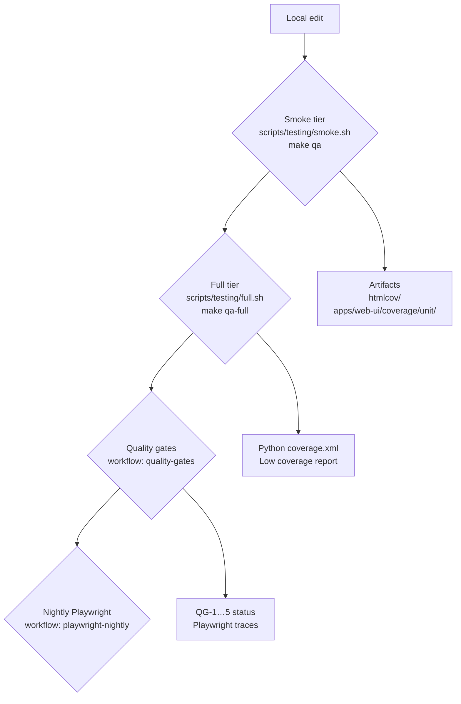

# Hotpass Testing & Coverage Strategy

_Last updated: 2025-11-01_

**Audience:** release managers, QA contributors, Copilot/Codex agents, and engineers who need to validate Hotpass before shipping changes.
**Purpose:** explain how to run, extend, and troubleshoot the Hotpass automated test suites so that fast smoke checks and deeper gates stay reliable.

## Overview

Hotpass uses a layered test model that keeps local feedback fast while reserving heavier validation for scheduled workflows.

- **Smoke** keeps branch feedback under five minutes by running lint, targeted pytest, and Vitest coverage.
- **Full** adds security and style tooling so we catch regressions before a release branch is cut.
- **Quality gates** assert that the CLI, enrichment, MCP tooling, and docs remain compliant.
- **Nightly Playwright** replays critical UI journeys with trace capture to guard against drift.

## Quickstart (tutorial): run a smoke check on a new branch

### Before you begin

- Install Python extras once per clone: `make sync EXTRAS="dev orchestration"`.
- Install UI dependencies once per clone: `make web-ui-install`.
- Optional (only for Playwright): `cd apps/web-ui && npx playwright install --with-deps`.

### Steps

1. From the repo root, run `scripts/testing/smoke.sh` (or `make qa`).
2. Watch for the closing banner `Smoke QA complete`. The script streams lint/test output as it runs.

### Result

- Python coverage report written to `htmlcov/index.html`.
- XML coverage saved to `coverage.xml` (thanks to `pytest` `addopts` in `pyproject.toml`).
- Vitest coverage written to `apps/web-ui/coverage/unit/`.
- CI parity confirmed: this is the same suite executed by `.github/workflows/ci-smoke.yml`.

If any command fails, the script exits immediately with a non-zero code so CI can halt.

## How-to guides

### Run the smoke tier on demand

**Use when:** validating day-to-day commits or responding to PR review comments.

1. Run `scripts/testing/smoke.sh` (or `make qa`) from the repo root.
2. Inspect `htmlcov/index.html` for module-level coverage if you touched Python logic.
3. Open `apps/web-ui/coverage/unit/index.html` to review UI coverage hot spots.

**Result:** fast signal (<5 minutes on ARC runners) with lint, targeted pytest, and Vitest coverage.

### Run the full regression before a release

**Use when:** preparing a release candidate or investigating flaky behaviour flagged by the smoke run.

1. Execute `scripts/testing/full.sh` (or `make qa-full`).
2. Review the console output for failures from `pytest`, `mypy`, `bandit`, `detect-secrets`, and `pre-commit`.
3. If the coverage summary reports modules under 5% lines or 0% branches, check the offending list emitted by `tools/coverage/report_low_coverage.py`.

**Result:** comprehensive validation (~40 minutes on hosted runners) mirroring `.github/workflows/quality-gates.yml`.

### Run UI unit tests in isolation

**Use when:** iterating on web components without touching the Python stack.

1. `cd apps/web-ui`.
2. Run `npm run test:unit` (Vitest with coverage).
3. Optionally follow with `npm run test:e2e` to exercise Playwright journeys locally (ensure you ran `npx playwright install --with-deps` once).

**Result:** UI-only signal with coverage reports under `apps/web-ui/coverage/unit/`.

### Validate quality gates locally

**Use when:** you need to reproduce nightly failures or confirm the contract suites before merging.

1. Run the full regression (`scripts/testing/full.sh`) to seed artefacts.
2. Execute `uv run pytest tests/cli/test_quality_gates.py -v`.
3. Expect **26 passed tests (as of 2025-11)**: QG-1 (CLI) through QG-5 (Docs). Failures indicate a regression in CLI verbs, enrichment workflows, MCP discoverability, or docs currency.

**Result:** parity with the nightly `quality-gates` workflow, including Playwright shard scheduling.

## Reference

### Test tiers by scope

| Tier         | Invocation                                         | Components covered                                                                                                        | When to run                                     | Target runtime |
|--------------|----------------------------------------------------|---------------------------------------------------------------------------------------------------------------------------|-------------------------------------------------|----------------|
| Smoke        | `scripts/testing/smoke.sh` · `make qa`              | `ruff` (apps/web-ui), `pytest -m "smoke"` with coverage, `uv run coverage html`, Vitest coverage (`npm run test:unit`)    | Every PR and before pushing shared branches     | < 5 minutes    |
| Full         | `scripts/testing/full.sh` · `make qa-full`          | Smoke suite + full `pytest`, HTML/XML coverage, low-coverage audit, `mypy`, `bandit`, `detect-secrets`, `pre-commit`     | Before releases, after dependency upgrades      | < 45 minutes   |
| Quality gates| `.github/workflows/quality-gates.yml` (scheduled)  | Full regression, Quality Gate checks (QG-1…5), Playwright shard                                                           | Nightly on `main`, manual reruns for incidents  | < 60 minutes   |
| Nightly E2E  | `.github/workflows/playwright-nightly.yml`         | Playwright Chromium journeys with trace/HTML reports                                                                     | Nightly or after major UI merges               | < 40 minutes   |

### Coverage expectations

| Suite        | Thresholds enforced                                                                                   |
|--------------|-------------------------------------------------------------------------------------------------------|
| Smoke pytest | `coverage report --fail-under=70` (configured via CI environment)                                     |
| Full/Nightly | `coverage report --fail-under=80`; additional module-level audit via `report_low_coverage.py --min-lines 5 --min-branches 0` |
| Vitest       | `vitest.config.ts` enforces ≥60% statements/lines/functions and ≥50% branches                         |

**Artifacts uploaded by CI:** `coverage.xml`, `htmlcov/`, `apps/web-ui/coverage/unit/`, Playwright traces (`playwright-report/`), and Quality Gate logs under `dist/quality-gates/`.

### CI automation map

- `.github/workflows/ci-smoke.yml` — PR/push smoke gates. Publishes `python-smoke-coverage` and `web-unit-coverage` artefacts.
- `.github/workflows/quality-gates.yml` — nightly mainline protection. Orchestrates `scripts/testing/full.sh`, Quality Gate pytest suite, and Playwright shard.
- `.github/workflows/playwright-nightly.yml` — dedicated UI coverage to catch regressions outside the nightly gate window.

## Concepts and policies (explanation)

### Bandwidth markers

- Use `@pytest.mark.bandwidth("smoke")` (or `pytestmark = pytest.mark.bandwidth("smoke")`) for deterministic tests.
- Heavy directories such as `tests/pipeline`, `tests/research`, and `tests/quality` are auto-classified as `bandwidth("quality_gate")` or `bandwidth("slow")` in `tests/conftest.py`.
- Unmarked tests default to `bandwidth("full")`, ensuring smoke runs remain predictable.

### Coverage reporting

- `pyproject.toml` defines `pytest` `addopts` that emit both terminal and XML coverage without extra flags.
- `scripts/testing/full.sh` calls `uv run python tools/coverage/report_low_coverage.py coverage.xml --min-lines 5 --min-branches 0` to highlight modules with effectively no coverage. Adjust thresholds upward as we increase confidence.
- Keep `htmlcov/` and `apps/web-ui/coverage/unit/` for auditing regressions during release readiness reviews.

### Assertion guardrail

- Follow `docs/how-to-guides/assert-free-pytest.md`: wrap expectations with the shared `expect(condition, message)` helper instead of bare `assert` statements so Bandit rule **B101** remains green.

### Ephemeral runner considerations

- ARC runners pin `pytest` xdist workers to 2 to respect CPU limits.
- `uv sync` caches are keyed to `uv.lock`; avoid unnecessary lock bumps to keep cache reuse high.
- Playwright CI workers are capped at 2 (`apps/web-ui/playwright.config.ts`) to stay under hosted runner quotas.

## Troubleshooting

| Symptom                                                                 | Likely cause                                               | Fix                                                                                  |
|-------------------------------------------------------------------------|------------------------------------------------------------|--------------------------------------------------------------------------------------|
| `uv: command not found`                                                 | `uv` not installed locally                                 | `python -m pip install -U uv`, then rerun the script                                 |
| `ModuleNotFoundError` during pytest                                    | Missing Python extras                                      | `make sync EXTRAS="dev orchestration"`                                               |
| Vitest exits with `ERR_MODULE_NOT_FOUND`                               | Node modules absent                                        | `make web-ui-install`                                                                |
| Playwright complains about missing browsers                           | Playwright binaries not installed                          | `cd apps/web-ui && npx playwright install --with-deps`                               |
| `detect-secrets` finds unexpected baselines                           | Out-of-date baselines in repo                              | Run `python -m detect_secrets scan ...` locally, review, and update baseline as needed|
| Coverage report empty                                                  | Tests exited before coverage finalised                     | Rerun suite; ensure no early exit skips `uv run coverage html`                      |

## Related resources

- `docs/how-to-guides/assert-free-pytest.md` — pytest assertion style guide.
- `UPGRADE.md` — CLI and MCP quality gate expectations.
- `AGENTS.md` — environment setup for Codex/Copilot agents.
- `tests/cli/test_quality_gates.py` — source for the QG-1…5 assertions.
- `scripts/testing/` — smoke/full shell entry points referenced in this guide.
